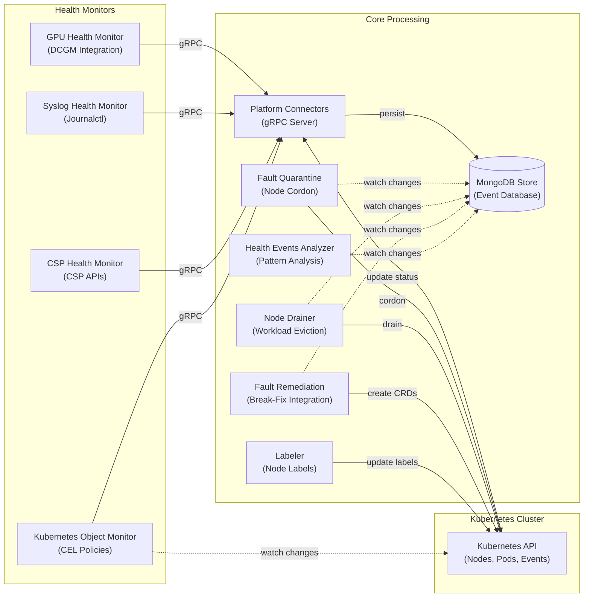

# NVSentinel
**GPU Fault Detection and Remediation for Kubernetes**

NVSentinel automatically detects, classifies, and remediates hardware and software faults in GPU nodes. It monitors GPU health, system logs, and cloud provider maintenance events, then takes action: cordoning faulty nodes, draining workloads, and triggering break-fix workflows.

> [!NOTE]
> **Beta / Stable**
> NVSentinel is ready for production testing and use. APIs, configurations, and features may change between releases. If you encounter issues, please [open an issue](https://github.com/NVIDIA/NVSentinel/issues) or [start a discussion](https://github.com/NVIDIA/NVSentinel/discussions).

## 🚀 Quick Start

### Prerequisites

- Kubernetes 1.25+
- NVIDIA GPU Operator (includes DCGM for GPU monitoring)
- Prometheus (for metrics)

## ✨ Key Features

- **🔍 Comprehensive Monitoring**: Real-time detection of GPU, NVSwitch, and system-level failures
- **🔧 Automated Remediation**: Intelligent fault handling with cordon, drain, and break-fix workflows
- **📦 Modular Architecture**: Pluggable health monitors with standardized gRPC interfaces
- **🔄 High Availability**: Kubernetes-native design with replica support and leader election
- **⚡ Real-time Processing**: Event-driven architecture with immediate fault response
- **📊 Persistent Storage**: MongoDB-based event store with change streams for real-time updates
- **🛡️ Graceful Handling**: Coordinated workload eviction with configurable timeouts
- **🏷️ Metadata Enrichment**: Automatic augmentation of health events with cloud provider and node metadata information

> **Testing**: The example above uses default settings. For production, customize values for your environment.

> **Production**: By default, only health monitoring is enabled. Enable fault quarantine and remediation modules via Helm values. See [Configuration](#-configuration) below.

## 🎮 Try the Demo

Want to see NVSentinel in action without GPU hardware? Try our **[Local Fault Injection Demo](demos/local-fault-injection-demo/README.md)**:

- 🚀 **5-minute setup** - runs entirely in a local KIND cluster
- 🔍 **Real pipeline** - see fault detection → quarantine → node cordon
- 🎯 **No GPU required** - uses simulated DCGM for testing

```bash
cd demos/local-fault-injection-demo
make demo  # Automated: creates cluster, installs NVSentinel, injects fault, verifies cordon
```

Perfect for learning, presentations, or CI/CD testing!

## 🏗️ Architecture

NVSentinel follows a microservices architecture with modular health monitors and core processing modules:



**Data Flow**:
1. **Health Monitors** detect hardware/software faults and send events via gRPC to Platform Connectors
2. **Platform Connectors** validate, persist events to MongoDB, and update Kubernetes node conditions
3. **Core Modules** independently watch MongoDB change streams for relevant events
4. **Modules** interact with Kubernetes API to cordon, drain, label nodes, and create remediation CRDs
5. **Labeler** monitors pods to automatically label nodes with DCGM and driver versions

> **Note**: All modules operate independently without direct communication. Coordination happens through MongoDB change streams and Kubernetes API.

## ⚙️ Configuration

NVSentinel is highly configurable with options for each module. For complete configuration documentation, see the **[Helm Chart README](distros/kubernetes/README.md)**.

### Quick Configuration Overview

```yaml
global:
  dryRun: false  # Test mode - log actions without executing
  
  # Health Monitors (enabled by default)
  gpuHealthMonitor:
    enabled: true
  syslogHealthMonitor:
    enabled: true

  # Core Modules (disabled by default - enable for production)
  faultQuarantine:
    enabled: false
  nodeDrainer:
    enabled: false
  faultRemediation:
    enabled: false
  janitor:
    enabled: false
  mongodbStore:
    enabled: false 
```

**Configuration Resources**:
- **[Helm Chart Configuration Guide](distros/kubernetes/README.md#configuration)**: Complete configuration reference
- **[values-full.yaml](distros/kubernetes/nvsentinel/values-full.yaml)**: Detailed reference with all options
- **[values.yaml](distros/kubernetes/nvsentinel/values.yaml)**: Default values

## 📦 Module Details

For detailed module configuration, see the **[Helm Chart Configuration Guide](distros/kubernetes/README.md#module-specific-configuration)**.

### 🔍 Health Monitors

- **[GPU Health Monitor](docs/gpu-health-monitor.md)**: Monitors GPU hardware health via DCGM - detects thermal issues, ECC errors, and XID events
- **[Syslog Health Monitor](docs/syslog-health-monitor.md)**: Analyzes system logs for hardware and software fault patterns via journalctl
- **CSP Health Monitor**: Integrates with cloud provider APIs (GCP/AWS) for maintenance events
- **[Kubernetes Object Monitor](docs/kubernetes-object-monitor.md)**: Policy-based monitoring for any Kubernetes resource using CEL expressions

### 🏗️ Core Modules

- **[Platform Connectors](docs/platform-connectors.md)**: Receives health events from monitors via gRPC, persists to MongoDB, and updates Kubernetes node status
- **[Fault Quarantine](docs/fault-quarantine.md)**: Watches MongoDB for health events and cordons nodes based on configurable CEL rules
- **[Node Drainer](docs/node-drainer.md)**: Gracefully evicts workloads from cordoned nodes with per-namespace eviction strategies
- **[Fault Remediation](docs/fault-remediation.md)**: Triggers external break-fix systems by creating maintenance CRDs after drain completion
- **Janitor**: Executes node reboots and terminations via cloud provider APIs
- **Health Events Analyzer**: Analyzes event patterns and generates recommended actions
- **[Event Exporter](docs/event-exporter.md)**: Streams health events to external systems in CloudEvents format
- **MongoDB Store**: Persistent storage for health events with real-time change streams
- **[Labeler](docs/labeler.md)**: Automatically labels nodes with DCGM and driver versions for self-configuration
- **[Metadata Collector](docs/metadata-collector.md)**: Gathers GPU and NVSwitch topology information
- **[Log Collection](docs/log-collection.md)**: Collects diagnostic logs and GPU reports for troubleshooting

## 📋 Requirements

- **Kubernetes**: 1.25 or later
- **Helm**: 3.0 or later
- **NVIDIA GPU Operator**: For GPU monitoring capabilities (includes DCGM)
- **Storage**: Persistent storage for MongoDB (recommended 10GB+)
- **Network**: Cluster networking for inter-service communication

## 📄 License

This project is licensed under the Apache License 2.0 - see the [LICENSE](LICENSE) file for details.

---

*Built with ❤️ by NVIDIA for GPU infrastructure reliability*